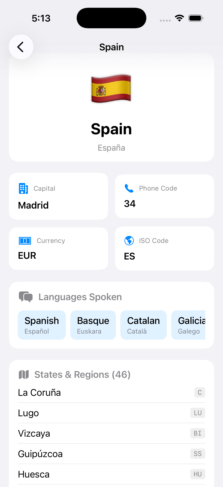

# ApolloDemo

This app is to show how to setup and use the apollo SDK in the xcode project.
When the starts it it will load the list of countries and show the country details upon selected the country.

#### Countries List
-------------------.


#### Country Details



## Requiremnts
1. Xcode 26.5
2. supported version: 
    ios 26.5 min version

## GraphQL

### Install Apollo iOS CLI


#### Create apollo codegen config json file

./apollo-ios-cli init --schema-namespace CountriesAPI --module-type swiftPackage

Generate graph QL queies
./Scripts/generate-graphql.sh

Step 1: Generate the package
First, make sure the package exists:

Here is what ```./apollo-ios-cli generate``` do
Bash: ./apollo-ios-cli generate

CountriesAPI/
├── Package.swift
└── Sources/
    └── Schema/
        ├── SchemaConfiguration.swift
        └── SchemaMetadata.graphql.swift

Step 2: Add the package to Xcode
In Xcode:
File → Add Package Dependencies...
Click Add Local...
Select the generated CountriesAPI folder (the one containing Package.swift).
Click Add Package.
Add the CountriesAPI product to your app target.

Step 3: Import the package
In your Swift file:
Now this should compile:
```
import CountriesAPI
let query = CountriesQuery()
```
Downloads the GraphQL schema definition from the backend server.
```./apollo-ios-cli fetch-schema```

Translates GraphQL schema & .graphql query files into type-safe Swift code.
```./apollo-ios-cli generate``

## Architecture Overview
This project is a modern, protocol-oriented iOS application built using SwiftUI, GraphQL, and Swift 6 Concurrency. It emphasizes strict adherence to SOLID principles, lightweight dependency injection, and thread-safe data layers.

## 🛠️ Tech Stack & Key Paradigms
UI Framework: SwiftUI (with Swift 5.9+ @Observable macro)
API Integration: GraphQL over custom POST network execution
Concurrency: Swift 6 async/await, actor types, and Sendable conformance
Architecture: MVVM with Protocol-Oriented Data Sources and Closure-Backed Factories

## 🏛️ System Architecture & Object Lifecycles
┌────────────────────────────────────────────────────────────────────────┐
│                          App Composition Root                          │
│                      (ApolloDemoApp / Entry Point)                     │
└───────────────────────────────────┬────────────────────────────────────┘
                                    │
                                    ▼
┌────────────────────────────────────────────────────────────────────────┐
│                        Networking & Service Layer                      │
│                  (CountriesServices / CountriesManager)                │
└───────────────────────────────────┬────────────────────────────────────┘
                                    │
                                    ▼
┌────────────────────────────────────────────────────────────────────────┐
│                          Thread-Safe Data Layer                        │
│                   (actor CountryDetailDataSource)                      │
│               Scope: Shared / Long-Lived across app session            │
└───────────────────────────────────┬────────────────────────────────────┘
                                    │
                                    ▼
┌────────────────────────────────────────────────────────────────────────┐
│                          Factory / Navigation Layer                    │
│             (CountryDetailsViewFactory / CountryDetailsViewManager)    │
│              Creates fresh ViewModels on every navigation push         │
└───────────────────────────────────┬────────────────────────────────────┘
                                    │
                                    ▼
┌────────────────────────────────────────────────────────────────────────┐
│                          UI & Presentation Layer                       │
│                   (CountryDetailsView + ViewModel)                     │
│               Scope: Per-Screen / Short-Lived UI State                 │
└────────────────────────────────────────────────────────────────────────┘

## 🧩 Key Layers Explained
### 1. Networking & Service Layer (CountriesServices)
Defines the generic network interface for executing GraphQL queries.
CountriesServices Protocol: A Sendable protocol exposing a single, type-safe generic method for fetching GraphQL queries.
CountriesManager: Implements CountriesServices. Encodes GraphQL query payloads, constructs POST requests, and delegates execution to an injected Networking instance.
### 2. Thread-Safe Data Sources (actor)
Data sources manage API interaction and business logic.
Defined as actor types to guarantee compile-time thread safety under Swift 6.
Conforms to fine-grained APIs (CountryDetailDataSourceAPI) respecting the Interface Segregation Principle (ISP).
Lifetime: Instantiated once at the composition root and shared safely across factories.
### 3. Factory & Dependency Injection (CountryDetailsViewManager)
Navigating between screens utilizes a closure-backed Factory pattern.
ISP Compliance: CountriesListView depends strictly on CountryDetailsViewFactory, preventing fat container leaks or broad feature dependencies.
State Isolation: The factory reuses long-lived data sources while generating a fresh @Observable ViewModel instance for every view push. This avoids state leaks across navigation stacks.
### 4. Presentation & UI Layer (@Observable MVVM)
CountryDetailsViewModel: Uses @Observable for fine-grained SwiftUI updates. Manages loading states, errors, and fetched models.
Async Error Handling: Utilizes a custom Result extension to safely execute async throws tasks without Task wrapper boilerplate.