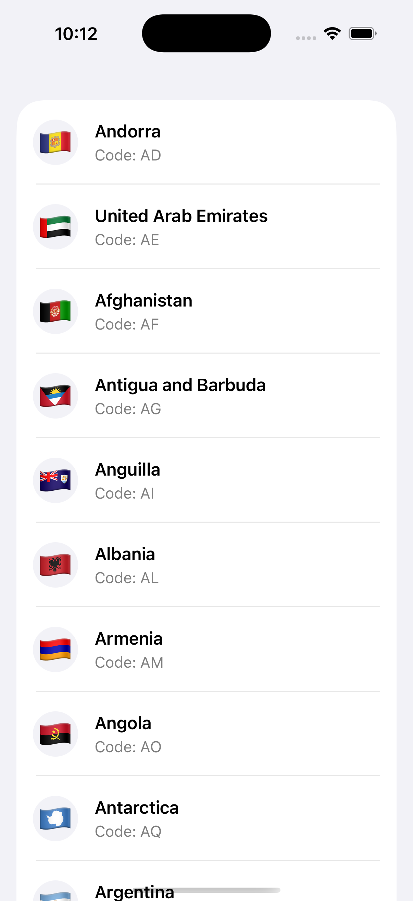

# ApolloDemo



## GraphQL

### Install Apollo iOS CLI


#### Create apollo codegen config json file

./apollo-ios-cli init --schema-namespace CountriesAPI --module-type swiftPackage

Generate graph QL queies
./Scripts/generate-graphql.sh

Step 1: Generate the package
First, make sure the package exists:

Here is what ```./apollo-ios-cli generate``` do
Bash: ./apollo-ios-cli generate

CountriesAPI/
├── Package.swift
└── Sources/
    └── Schema/
        ├── SchemaConfiguration.swift
        └── SchemaMetadata.graphql.swift

Step 2: Add the package to Xcode
In Xcode:
File → Add Package Dependencies...
Click Add Local...
Select the generated CountriesAPI folder (the one containing Package.swift).
Click Add Package.
Add the CountriesAPI product to your app target.

Step 3: Import the package
In your Swift file:
Now this should compile:
```
import CountriesAPI
let query = CountriesQuery()
```
Downloads the GraphQL schema definition from the backend server.
```./apollo-ios-cli fetch-schema```

Translates GraphQL schema & .graphql query files into type-safe Swift code.
```./apollo-ios-cli generate``1